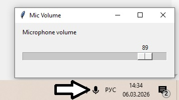

# Дисклеймер: данная утилита полностью написана через ChatGPT. Как и данный README.

---
# MicTray — простая утилита для регулировки громкости микрофона (Windows)

**Коротко:** программа сворачивается в системный трей и даёт быстрый доступ к громкости микрофона через удобный ползунок.  
Цель — убрать лишние клики в стандартных настройках Windows и регулировать микрофон в 1–2 клика.

---

## Возможности
- Иконка в трее (левый клик открывает окно с ползунком).
- Регулировка системной громкости микрофона.
- Без лишних окон (можно запускать через `pythonw` / `start.bat`).
- Лёгкая упаковка в `.exe` при желании (PyInstaller).

---

## Требования
- Windows 10 x64 (тестировалось на Win10 x64).
- Python 3.13.12 (рекомендуется 3.10+).
- Библиотеки:
  - `pycaw`
  - `comtypes`
  - `pystray`
  - `Pillow` (для загрузки/фолбэка иконки)

---

